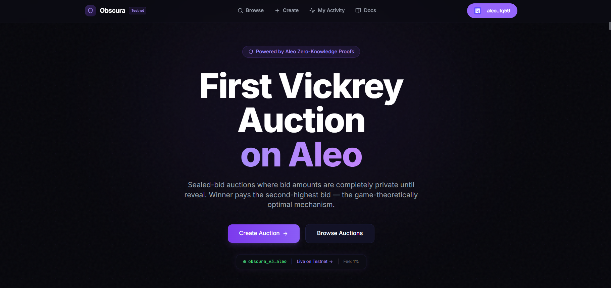
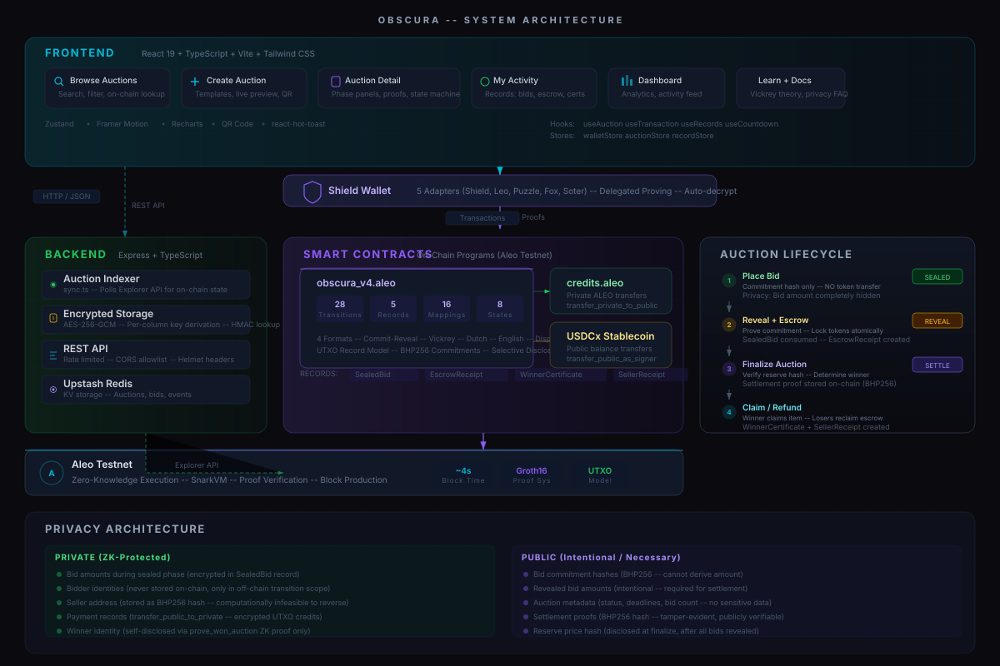
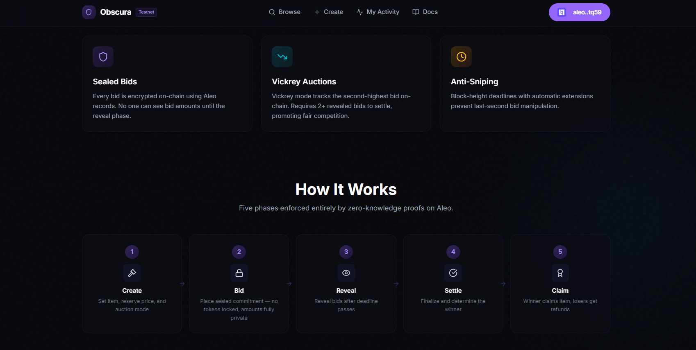

# Obscura — Privacy-First Multi-Format Auction Protocol on Aleo

> The private auction layer for digital assets on Aleo. 4 formats, 3 tokens, 28 ZK transitions.

**[Live Demo](https://obscura-auction-95hm.vercel.app)** | **[Contract on Explorer](https://testnet.explorer.provable.com/program/obscura_v4.aleo)** | **[Deploy TX](https://testnet.explorer.provable.com/transaction/at1f3sxnlttr6spyvzgjhg7j9n40r088xuck04a9z5wxnuv9m09gc9suq928a)** | **Shield Wallet Required**

## Wave 4 Updates

- **4 Auction Formats**: Added Dutch (descending-price) and English (ascending, anti-sniping) alongside existing Sealed-Bid and Vickrey
- **Triple Token Support**: Added USAD stablecoin (`test_usad_stablecoin.aleo`) alongside ALEO Credits and USDCx
- **28 Transitions**: Up from 17 — real depth, not token duplication
- **Dispute Resolution**: Bond-based challenge mechanism (10% bond, admin resolution)
- **TypeScript SDK**: `@obscura/sdk` — programmatic auction creation, bidding, and on-chain reads
- **Auction Monitor Bot**: Automated on-chain state polling for auction tracking
- **ZK Social Proof**: "Share Your Win" — prove you won without revealing your bid amount (`prove_won_auction`)
- **Mode-Aware UI**: Every page adapts to the auction format — timelines, bid panels, privacy notices
- **Privacy Dashboard & QR Sharing**: Real-time privacy status visualization and instant auction sharing
- **Contract**: [`obscura_v4.aleo`](https://testnet.explorer.provable.com/program/obscura_v4.aleo) — deployed on Aleo Testnet



---

## What is Obscura?

Obscura is a sealed-bid auction protocol on Aleo where bid amounts are cryptographically invisible during the bidding phase, bidder identities are never stored on-chain, and the winner self-identifies by proving ownership of a private record. It supports both first-price and Vickrey (second-price) auctions with full token escrow via `credits.aleo` and `test_usdcx_stablecoin.aleo`. The commit-reveal architecture ensures no party — not the seller, not the platform, not other bidders — can see bid amounts until the reveal phase, when disclosure is intentional and voluntary. In Wave 4, the protocol expanded to support four auction formats (Sealed-Bid, Vickrey, Dutch, English), three tokens (ALEO, USDCx, USAD), dispute resolution, and a TypeScript SDK for programmatic integration.

---

## Architecture



---

## Privacy Model

| Data | During Bidding | After Reveal | Mechanism |
|------|---------------|--------------|-----------|
| Bid Amounts | **Private** — encrypted in SealedBid record | Public (intentional) | No token transfer at bid time; commit-reveal with BHP256 |
| Bidder Identity | **Private** — never on-chain | **Private** — never on-chain | Address used only in off-chain transition scope; record ownership |
| Reserve Price | **Private** — hash only on-chain | Verified at settlement | `BHP256(reserve_price)` stored; seller re-proves at finalize |
| Seller Address | **Private** — hash only on-chain | **Private** — hash only | `BHP256(address as field)` — computationally infeasible to reverse |
| Winner Identity | **Private** — unknown | **Private** — self-disclosed only | `prove_won_auction` selective disclosure via ZK proof |
| Payment Records | N/A | **Private** — UTXO credits | `transfer_public_to_private` creates encrypted credit records |
| Item Details | **Private** — BHP256 hash on-chain | **Private** — hash only | Title/description stored encrypted in backend, not on-chain |

**Key design choice**: No tokens move during `place_bid`. An observer watching `credits.aleo` transfers learns nothing about bid amounts during the sealed phase. Token escrow happens at `reveal_bid`, when amounts are intentionally public.

---

## How It Works

### Step 1: Create Auction
Seller calls `create_auction` with item hash, category, reserve price, auction mode (First-Price or Vickrey), token type (ALEO or USDCx), and deadline. The reserve price is stored as a BHP256 hash — only the seller knows the actual value. The seller's address is hashed, never stored in plaintext.

### Step 2: Place Sealed Bid
Bidders call `place_bid` with their bid amount and a random nonce. A BHP256 commitment hash is stored on-chain (prevents replay), but the bid amount is encrypted inside a private `SealedBid` record. **No tokens are transferred** — this is the privacy innovation. Anti-sniping protection extends the deadline by ~10 minutes for bids placed in the final ~10 minutes.

### Step 3: Reveal Bid + Escrow
After bidding closes, bidders call `reveal_bid` to prove their commitment and escrow tokens atomically. The `SealedBid` record is consumed (UTXO model prevents double-reveal). Highest and second-highest bids are tracked on-chain for Vickrey support.

### Step 4: Finalize Auction
The seller calls `finalize_auction`, re-entering the reserve price (verified against the stored hash). If the highest bid meets the reserve, the auction settles. If it's a Vickrey auction and fewer than 2 bids revealed, it fails. A tamper-evident `settlement_proof` hash is stored on-chain.

### Step 5: Claim / Refund
- **Winner** calls `claim_win` (first-price) or `claim_win_vickrey` (second-price). Seller receives private ALEO credits or public USDCx. Winner gets a `WinnerCertificate` record. In Vickrey mode, the winner is refunded the difference between their bid and the second-highest.
- **Losers** call `claim_refund` to reclaim their escrowed tokens as private credits.
- **Winner can prove ownership** later via `prove_won_auction` — a selective disclosure ZK proof that reveals nothing about the bid amount.



---

## Vickrey (Second-Price) Auctions

In a standard first-price auction, rational bidders shade their bids below their true valuation to protect surplus. This leads to inefficient markets. In a Vickrey auction, the winner pays the **second-highest bid**, not their own. This makes bidding your true valuation a **dominant strategy** — optimal regardless of what others do.

**Why ZK is required**: Traditional Vickrey auctions require trusting the auctioneer to honestly report the second price. With Obscura, the `second_highest_bids` mapping is updated atomically in on-chain finalize logic — no party can manipulate it. Any observer can verify the second price on-chain.

**Real-world usage**: Google Ads (generalized second-price), US Treasury auctions, FCC spectrum auctions, ICANN domain sales — all use Vickrey-style mechanisms for optimal price discovery.

See [VICKREY_EXPLAINER.md](./VICKREY_EXPLAINER.md) for the full game-theoretic analysis with worked examples.

---

## Token Support

| Token | Deposit (Escrow) | Payout | Privacy Level |
|-------|-----------------|--------|---------------|
| **ALEO Credits** | `credits.aleo/transfer_private_to_public` | `credits.aleo/transfer_public_to_private` | Full privacy — private records in, private records out |
| **USDCx Stablecoin** | `test_usdcx_stablecoin.aleo/transfer_public_as_signer` | `test_usdcx_stablecoin.aleo/transfer_public` | Public balance transfers |
| **USAD Stablecoin** | `test_usad_stablecoin.aleo/transfer_public_as_signer` | `test_usad_stablecoin.aleo/transfer_public` | Public balance transfers |

ALEO path: Bidder's private credits record → program's public balance (escrow) → private credits record (payout to seller/refund). The sender and recipient are hidden in both directions.

USDCx path: Bidder's public USDCx balance → program's public balance (escrow) → recipient's public balance (payout). USDCx uses public balances by design.

USAD path: Same as USDCx — public balance transfers via `test_usad_stablecoin.aleo`.

---

## Smart Contract Architecture

**Program**: `obscura_v4.aleo` — deployed on Aleo Testnet

```
Transitions:    28
Records:         5 (SealedBid, EscrowReceipt, WinnerCertificate, SellerReceipt, DisputeBond)
Mappings:       16
Structs:         8
State Machine:   8 states
Tokens:         credits.aleo + test_usdcx_stablecoin.aleo + test_usad_stablecoin.aleo
Formats:        First-Price Sealed-Bid, Vickrey (2nd-Price), Dutch (Descending), English (Ascending)
```

### All 28 Transitions (Grouped)

| Group | Transitions | Purpose |
|-------|------------|---------|
| **Platform** | `initialize_platform`, `admin_emergency`, `withdraw_fees` | Setup, emergency controls, fee collection |
| **Auction Lifecycle** | `create_auction`, `create_dutch_auction`, `cancel_auction`, `close_bidding` | Create (sealed/Vickrey/English + Dutch), cancel, close |
| **Sealed Bidding** | `place_bid` | Submit encrypted bid commitment (**no token transfer**) |
| **Reveal + Escrow** | `reveal_bid`, `reveal_bid_usdcx`, `reveal_bid_usad` | Reveal bid + lock tokens atomically (3 token variants) |
| **Settlement** | `finalize_auction`, `settle_english` | Determine winner for sealed-bid and English formats |
| **Claim (1st-Price)** | `claim_win`, `claim_win_usdcx`, `claim_win_usad` | First-price winner + seller settlement (3 token variants) |
| **Claim (Vickrey)** | `claim_win_vickrey`, `claim_win_vickrey_usdcx` | Second-price settlement + refund difference (2 token variants) |
| **Refunds** | `claim_refund`, `claim_refund_usdcx`, `claim_refund_usad` | Losers reclaim escrowed tokens (3 token variants) |
| **Dutch** | `bid_dutch`, `bid_dutch_usdcx` | Instant buy at current descending price (2 token variants) |
| **English** | `bid_english`, `bid_english_usdcx` | Place ascending bid with 5% min increment (2 token variants) |
| **Dispute** | `dispute_auction`, `resolve_dispute` | Bond-based challenge mechanism (10% bond, admin resolution) |
| **ZK Proof** | `prove_won_auction` | Selective disclosure — prove you won without revealing bid amount |

### Records (5 — All Private)

| Record | Created By | Contains | Consumed By |
|--------|-----------|----------|-------------|
| `SealedBid` | `place_bid` | auction_id, bid_amount, bid_nonce, token_type | `reveal_bid` / `reveal_bid_usdcx` |
| `EscrowReceipt` | `reveal_bid` / `reveal_bid_usdcx` | auction_id, escrowed_amount, bid_nonce, token_type | `claim_win*` / `claim_refund*` |
| `WinnerCertificate` | `claim_win*` | auction_id, item_hash, winning_amount, token_type, certificate_id | Never consumed (kept as proof) |
| `SellerReceipt` | `claim_win*` | auction_id, item_hash, sale_amount, fee_paid, token_type | Never consumed (kept as proof) |
| `DisputeBond` | `dispute_auction` | auction_id, bond_amount | `resolve_dispute` |

### Mappings (16)

| Mapping | Key | Value | Purpose |
|---------|-----|-------|---------|
| `auctions` | field | AuctionData | Core auction state (hashes, status, deadlines) |
| `bid_commitments` | field | bool | Replay prevention — stores commitment hashes |
| `revealed_bids` | field | u128 | Post-reveal bid amounts |
| `highest_bids` | field | u128 | Highest revealed bid per auction |
| `second_highest_bids` | field | u128 | Second-highest for Vickrey |
| `auction_winners` | field | field | Winner's bid hash (not address) |
| `program_balance` | u8 | u128 | Pooled program balance by token type |
| `auction_escrow` | field | u128 | Per-auction escrowed total |
| `platform_treasury` | u8 | u128 | Accumulated fees by token type |
| `settlements` | field | SettlementData | Double-settlement prevention |
| `platform_config` | u8 | PlatformConfig | Admin hash, fee rates, pause state |
| `settlement_proofs` | field | field | BHP256 hash of SettlementProof — tamper-evident |
| `payment_proofs` | field | field | BHP256 commit of payment amount — verifiable |
| `dutch_params` | field | DutchConfig | Dutch auction pricing: start_price, end_price |
| `disputes` | field | DisputeData | Dispute state: disputer_hash, bond_amount, reason_hash |
| `dispute_bonds` | field | u128 | Dispute bond amounts per auction |

### State Machine (8 States)

```
                 ┌──────────┐
                 │  ACTIVE   │ ← create_auction
                 │   (1)     │   Accepting bids (anti-snipe extends deadline)
                 └─────┬─────┘
                       │
       ┌───────────────┼───────────────┐
       │               │               │
  cancel_auction   close_bidding   close_bidding
  (0 bids only)    (has bids)      (0 bids)
       │               │               │
       ▼               ▼               ▼
 ┌───────────┐  ┌────────────┐  ┌───────────┐
 │ CANCELLED │  │ REVEALING  │  │  EXPIRED  │
 │    (5)    │  │    (3)     │  │    (8)    │
 └───────────┘  └─────┬──────┘  └───────────┘
                      │
           ┌──────────┼──────────┐
           │                     │
    finalize_auction      finalize_auction
    (reserve met)         (reserve NOT met
           │               OR Vickrey < 2 reveals)
           ▼                     │
    ┌────────────┐        ┌──────────┐
    │  SETTLED   │        │  FAILED  │
    │    (4)     │        │   (6)    │
    └─────┬──────┘        └──────────┘
          │
    claim_win / claim_win_vickrey
    claim_refund (losers)
```

Additional states: CLOSED (2) — bidding closed, awaiting reveals. DISPUTED (7) — active dispute, bond posted, awaiting admin resolution.

#### Dutch Auction Flow
```
┌──────────┐   bid_dutch    ┌──────────┐
│  ACTIVE  │ ─────────────→ │ SETTLED  │  (instant, first buyer wins)
│   (1)    │                │   (4)    │
└────┬─────┘                └──────────┘
     │ deadline passes, no buyer
     ▼
┌──────────┐
│ EXPIRED  │
│   (8)    │
└──────────┘
```

Price formula: `current_price = start_price - ((start_price - end_price) × elapsed / duration)`

#### English Auction Flow
```
┌──────────┐   settle_english   ┌──────────┐
│  ACTIVE  │ ─────────────────→ │ SETTLED  │  (highest bidder wins)
│   (1)    │  (after deadline)  │   (4)    │
└────┬─────┘                    └──────────┘
     │ no bids at deadline
     ▼
┌──────────┐
│  FAILED  │
│   (6)    │
└──────────┘
```

Anti-sniping: Bids in the last 40 blocks (~10 min) extend deadline by 40 blocks. 5% minimum bid increment enforced on-chain.

---

## Security Features

| Feature | Mechanism | Protection Against |
|---------|-----------|-------------------|
| **Anti-Sniping** | 40-block window (~10 min) — bids in final window extend deadline | Last-second bid manipulation |
| **Commit-Reveal Integrity** | `BHP256(BidCommitment)` stored at bid time, verified at reveal | Bid amount tampering after placement |
| **Double-Settlement Guard** | `settlements` mapping + `assert(!already_settled)` | Winner claiming twice |
| **Winner Double-Spend Block** | `claim_refund` checks `bid_hash != auction_winners[id]` | Winner also claiming refund |
| **Bid Replay Prevention** | `bid_commitments` mapping + unique nonce per bid | Duplicate bid submission |
| **Settlement Proofs** | `BHP256(SettlementProof{...})` stored in `settlement_proofs` mapping | Retroactive result tampering |
| **Payment Proofs** | `BHP256::commit_to_field(amount, nonce_scalar)` in `payment_proofs` | Verifiable payment without revealing nonce |
| **Selective Disclosure** | `prove_won_auction` — ZK proof of WinnerCertificate ownership | Proving you won without revealing amount |
| **Reserve Hash Verification** | `BHP256(reserve_price) == stored_hash` checked at finalize | Seller lying about reserve price |
| **UTXO Record Consumption** | SealedBid and EscrowReceipt consumed on use (Aleo's model) | Double-reveal, double-refund |

---

## Technology Stack

| Layer | Technology |
|-------|-----------|
| **Smart Contract** | Leo (Aleo's ZK language) — 28 transitions, 4 auction formats, `credits.aleo` + `test_usdcx_stablecoin.aleo` + `test_usad_stablecoin.aleo` |
| **Frontend** | React 19, TypeScript, Vite, Tailwind CSS, Zustand, Framer Motion |
| **Backend** | Express, TypeScript, AES-256-GCM per-column encryption, Upstash Redis |
| **Wallet** | Shield Wallet via `@provablehq/aleo-wallet-adaptor-react` (delegated proving) |
| **SDK** | `@obscura/sdk` — TypeScript client for programmatic auction creation, bidding, and on-chain reads |
| **Network** | Aleo Testnet |
| **Hosting** | Vercel (frontend + backend serverless) |

## TypeScript SDK

```bash
npm install @obscura/sdk
```

```typescript
import { ObscuraClient } from '@obscura/sdk';

const client = new ObscuraClient('https://api.explorer.provable.com/v1');

// Read on-chain state
const auction = await client.getAuction(auctionId);
const dutchPrice = await client.getDutchCurrentPrice(auctionId);
const isDisputable = client.isDisputable(auction);

// Prepare transactions (returns { functionName, inputs } for wallet execution)
const tx = client.prepareCreateDutchAuction({
  title: 'Genesis Token Sale',
  category: 4,
  startPrice: 10,
  endPrice: 1,
  tokenType: 1,
  durationBlocks: 360,
  currentBlockHeight: 12345,
});
```

The SDK also includes an auction monitor bot (`bot/`) for automated on-chain state polling.

---

## Quick Start

### Prerequisites
- Node.js 18+
- [Shield Wallet](https://shieldwallet.io/) browser extension (switch to Testnet)
- Aleo testnet credits ([faucet](https://faucet.aleo.org))

### Run Locally

```bash
# Clone
git clone https://github.com/Ritik200238/obscura-auction.git
cd obscura-auction

# Frontend
cd frontend
npm install --legacy-peer-deps
cp .env.example .env   # Set VITE_BACKEND_URL if running backend locally
npm run dev
# Opens at http://localhost:5173

# Backend (separate terminal)
cd backend
npm install
cp .env.example .env   # Set ENCRYPTION_KEY, KV_REST_API_URL, KV_REST_API_TOKEN
npm run dev
# API at http://localhost:3001
```

### Build Smart Contract
```bash
cd contracts/obscura_v4
leo build --network testnet --endpoint https://api.explorer.provable.com/v1
```

---

## Demo Guide

### As a Seller

1. **Connect Shield Wallet** — Click "Connect Wallet" in the top navigation. Ensure you're on Aleo Testnet with sufficient credits.

2. **Create Auction** — Navigate to `/create`. Fill in:
   - Item title and description (stored encrypted off-chain)
   - Category (Art, Collectible, Service, Other)
   - Reserve price in ALEO or USDCx (stored as BHP256 hash on-chain)
   - Auction mode: **First-Price**, **Vickrey (2nd-Price)**, **Dutch (Descending)**, or **English (Ascending)**
   - Token type: ALEO Credits, USDCx Stablecoin, or USAD Stablecoin
   - Duration (1h to 7d)
   - Quick Templates: Digital Assets, Token Sales, Services & Contracts, or Custom

3. **Submit Transaction** — Click "Create Auction". Shield Wallet will prompt for signature. After confirmation, the page shows your transaction ID and the on-chain auction ID. **Copy the auction ID** — bidders need this to find your auction.

4. **Wait for Bids** — Share the auction ID. Bidders place sealed bids during the active phase. You can monitor on the auction detail page (`/auction/{id}`).

5. **Close Bidding** — After the deadline passes, anyone can click "Close Bidding" on the auction detail page. This starts the reveal phase (~12 hours).

6. **Finalize Auction** — After the reveal deadline passes, navigate to the auction detail page. The "Settle" panel appears. **Re-enter your exact reserve price** (the contract verifies `BHP256(input) == stored_hash`). If the highest bid meets your reserve, the auction settles.

7. **Receive Payment** — When the winner calls `claim_win`, you receive a `SellerReceipt` record and payment as private ALEO credits (or public USDCx). Check your receipt in the My Activity page.

### As a Bidder

1. **Connect Shield Wallet** — Ensure you have testnet ALEO credits or USDCx balance.

2. **Find Auction** — Navigate to `/browse`. Search by auction ID, filter by status/token/mode, or enter an auction ID directly in the "On-Chain Lookup" field.

3. **Place Sealed Bid** — On the auction detail page (`/auction/{id}`), use the Bid panel. Enter your bid amount. The transaction creates a private `SealedBid` record — **no tokens are transferred yet**, and your bid amount is invisible to everyone. Note the anti-sniping indicator if it's near the deadline.

4. **Reveal Bid** — After bidding closes and the auction enters the REVEALING phase, use the Reveal panel. This consumes your `SealedBid` record, proves your commitment, and escrows your tokens. Your bid amount becomes public (this is the purpose of the reveal phase).

5. **If You Win (First-Price)** — The auction detail page shows the Claim panel. Click "Claim Win". You receive a `WinnerCertificate` record. The seller receives payment minus a 1% platform fee.

6. **If You Win (Vickrey)** — Same as above, but you pay the **second-highest bid** instead of your own. The difference is automatically refunded to your wallet as private credits.

7. **If You Lose** — Use the Refund panel to reclaim your escrowed tokens. They return as private ALEO credits (or public USDCx).

8. **Check Records** — Visit `/my-activity` to see your Sealed Bids, Escrow Receipts, and Winner Certificates. Each record links to its auction.

### Dutch Auction (Buyer)

1. **Find Dutch Auction** — On the Browse page, filter by Mode: Dutch. Or navigate directly to `/auction/{id}`.

2. **Watch the Price** — The auction detail page shows the current descending price in real-time. The price drops linearly from the starting price toward the floor price over the auction duration.

3. **Buy Now** — When the price reaches your target, click "Buy Now" in the Dutch Bid Panel. Settlement is instant — no reveal phase, no waiting. You are the winner.

### English Auction (Bidder)

1. **Find English Auction** — On the Browse page, filter by Mode: English.

2. **Place Ascending Bid** — Each bid must be at least 5% higher than the current highest bid. Your bid is visible (English auctions are open).

3. **Anti-Sniping** — If you bid within the last ~10 minutes, the deadline extends automatically. No last-second manipulation.

4. **Settlement** — After the deadline, anyone can click "Settle" on the auction page. The highest bidder wins.

---

## Deployed Contract

| Field | Value |
|-------|-------|
| **Program ID** | `obscura_v4.aleo` |
| **Network** | Aleo Testnet |
| **Deploy TX** | [`at1f3sxnlttr6spyvzgjhg7j9n40r088xuck04a9z5wxnuv9m09gc9suq928a`](https://testnet.explorer.provable.com/transaction/at1f3sxnlttr6spyvzgjhg7j9n40r088xuck04a9z5wxnuv9m09gc9suq928a) |
| **Initialize TX** | [`at1ugfznxv9dufgatesere2gkstvph492f3ykd6sj4ajdjqazmgvgrs97myfu`](https://testnet.explorer.provable.com/transaction/at1ugfznxv9dufgatesere2gkstvph492f3ykd6sj4ajdjqazmgvgrs97myfu) |
| **Platform Config** | fee_bps=100 (1%), dispute_bond_bps=500 (5%), paused=false |
| **Dependencies** | `credits.aleo`, `test_usdcx_stablecoin.aleo`, `test_usad_stablecoin.aleo` |
| **Explorer** | [View on Explorer](https://testnet.explorer.provable.com/program/obscura_v4.aleo) |

### Verified Test Transactions

| Action | TX ID |
|--------|-------|
| Create Auction | [`at14fpq6yazt7cye9pmhhuk6vgtem8zcxezc5p5yczndhmy43v0mv9qdn8qu2`](https://testnet.explorer.provable.com/transaction/at14fpq6yazt7cye9pmhhuk6vgtem8zcxezc5p5yczndhmy43v0mv9qdn8qu2) |
| Place Bid | [`at1nkl2w4jsztcqfqhue7ua5tmkksaze686xqmtkg0rd0g8jznwxqrqj8prxk`](https://testnet.explorer.provable.com/transaction/at1nkl2w4jsztcqfqhue7ua5tmkksaze686xqmtkg0rd0g8jznwxqrqj8prxk) |
| Close Bidding | [`at1enwthmddswqajfkctjpuwdzy7924fm6s2yqnxrydf3d97xs745qseg5ym5`](https://testnet.explorer.provable.com/transaction/at1enwthmddswqajfkctjpuwdzy7924fm6s2yqnxrydf3d97xs745qseg5ym5) |
| Reveal Bid | [`at1tz3fs6t82vx8peqvrxtzdyfr2tespy6kd92qhpeavhswcnf46urqqslxhx`](https://testnet.explorer.provable.com/transaction/at1tz3fs6t82vx8peqvrxtzdyfr2tespy6kd92qhpeavhswcnf46urqqslxhx) |

---

## Novel Contributions

1. **First Vickrey auction on Aleo** — Second-price mechanism with `second_highest_bids` mapping, on-chain and immutable. No other Aleo project has implemented this.
2. **Commit-reveal with zero transfer at bid time** — Unlike naive implementations that transfer tokens on bid (leaking amounts), Obscura defers escrow to reveal. This is correct sealed-bid architecture.
3. **Anti-sniping mechanism** — Block-height-based deadline extension (40-block window). Neither NullPay nor Veiled Markets implements this.
4. **Settlement proofs + Payment proofs** — On-chain tamper-evident hashes and cryptographic commitments for verifiable auction integrity.
5. **Selective disclosure via `prove_won_auction`** — ZK proof of winning without revealing the bid amount, enabling downstream use cases (marketplace, lending, insurance).
6. **Triple token support** — Full ALEO + USDCx + USAD paths for escrow, settlement, and refund across all auction modes.
7. **Hashed seller identity** — `BHP256(address as field)` — seller address never appears in any public mapping.
8. **Four auction formats** — First-Price, Vickrey, Dutch (descending-price), English (ascending, anti-sniping). No other Aleo project supports all four.
9. **Dispute resolution** — Bond-based challenge mechanism with 10% bond. Enables post-settlement appeals without trusting the auctioneer.
10. **ZK Social Proof** — "Share Your Win" feature surfaces `prove_won_auction` for winners to publicly prove they won without revealing their bid amount.

---

## Deep Dives

- **[ARCHITECTURE.md](./ARCHITECTURE.md)** — Full contract architecture, token flows, bug fixes, competitor comparison
- **[PRIVACY.md](./PRIVACY.md)** — Privacy model, attack vector analysis, lifecycle privacy audit
- **[VICKREY_EXPLAINER.md](./VICKREY_EXPLAINER.md)** — Game theory, why ZK is required, worked numerical examples

---

## License

MIT
